# 🚀 Azure Automation Lab: Scaling n8n Behind Cloudflare Zero Trust

**A Cloud Engineering Case Study in Troubleshooting, Scaling, and Security**

> This project demonstrates deploying a self-hosted **n8n** automation instance on **Azure**, secured with **Cloudflare Zero Trust (2FA)**, while solving real-world authentication and performance bottlenecks.

**Skills demonstrated:** Layer 7 routing · Zero Trust security design · OAuth2 integration · Docker orchestration · Cloud infrastructure scaling · Reverse proxy TLS termination

---

## Table of Contents

- [Mission](#-mission)
- [Architecture Overview](#-architecture-overview)
- [Phase 1: From 1 GB RAM Failure → 4 GB Resilient Infrastructure](#-phase-1-from-1-gb-ram-failure--4-gb-resilient-infrastructure)
- [Phase 2: Solving the "2FA Callback Deadlock"](#-phase-2-solving-the-2fa-callback-deadlock-with-zero-trust-longest-path-matching)
- [Phase 3: Fixing SSL "Death Loops" (HTTP 525/520)](#-phase-3-fixing-ssl-death-loops-http-525520)
- [Phase 4: Docker Permission Hardening](#-phase-4-docker-permission-hardening)
- [Deployment Performance Metrics](#-deployment-performance-metrics)
- [Project Structure](#-project-structure)
- [Key Takeaways](#-key-takeaways)

---

## 📌 Mission

Deploy a high-performance, secure **n8n** instance with:

- Zero Trust 2FA for administrative security
- Path-specific bypass for third-party OAuth callbacks
- Resilient infrastructure on Azure
- Automated TLS management via Caddy reverse proxy
- Scalable Node.js memory management

---

## 🏗️ Architecture Overview

### End-to-End Request Flow

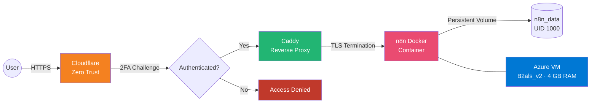

### Internal Component Stack

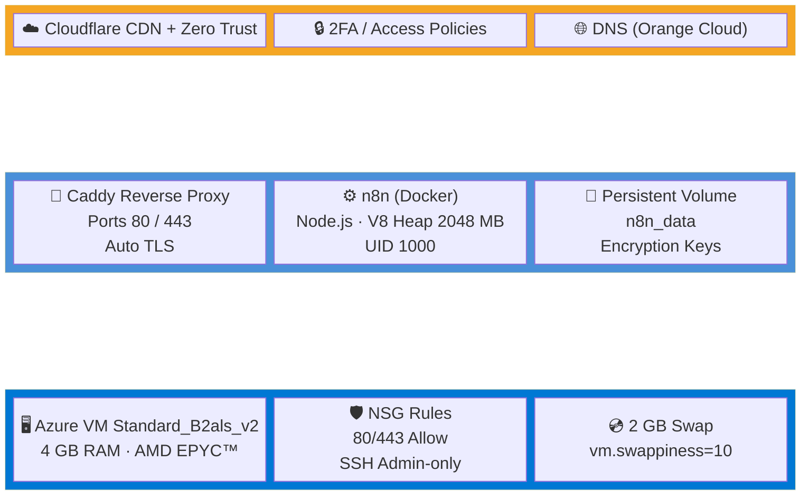

---

## 🛠️ Phase 1: From 1 GB RAM Failure → 4 GB Resilient Infrastructure

The project initially launched on an **Azure B1ls** (1 GB RAM) and immediately crashed due to **Out Of Memory (OOM)** errors.

### Scaling Timeline

```mermaid
gantt
    title Infrastructure Scaling Timeline
    dateFormat X
    axisFormat %s

    section Diagnosis
    OOM crash detected           :crit, done, 0, 1
    Identified 1 GB RAM limit    :done, 1, 2

    section Scaling
    Hot resize to B2als_v2 4 GB  :done, 2, 3
    Static IP migration          :done, 3, 4

    section Hardening
    Kernel tuning swappiness     :done, 4, 5
    2 GB swap provisioned        :done, 5, 6
    Node V8 heap set to 2048 MB  :done, 6, 7
```

### Infrastructure Upgrade & Fixes

| Action | Detail |
|---|---|
| **Hot Resize** | Azure instance scaled to **Standard_B2als_v2** (4 GB RAM, AMD EPYC™) |
| **Static IP Migration** | Prevented DNS de-propagation during resize |
| **Kernel Tuning** | `vm.swappiness=10` to prioritize RAM over swap |
| **Swapfile Provisioning** | 2 GB swap to safeguard memory-intensive workflows |
| **Node.js Heap Limiting** | V8 heap set to 2048 MB for stability |

```bash
# Swap provisioning commands
sudo fallocate -l 2G /swapfile
sudo chmod 600 /swapfile
sudo mkswap /swapfile
sudo swapon /swapfile
```

---

## 🔐 Phase 2: Solving the "2FA Callback Deadlock" with Zero Trust Longest Path Matching

Cloudflare Zero Trust's **2FA** blocked the **Google OAuth2** callback, creating a transport error in n8n.

### The Problem: OAuth Deadlock

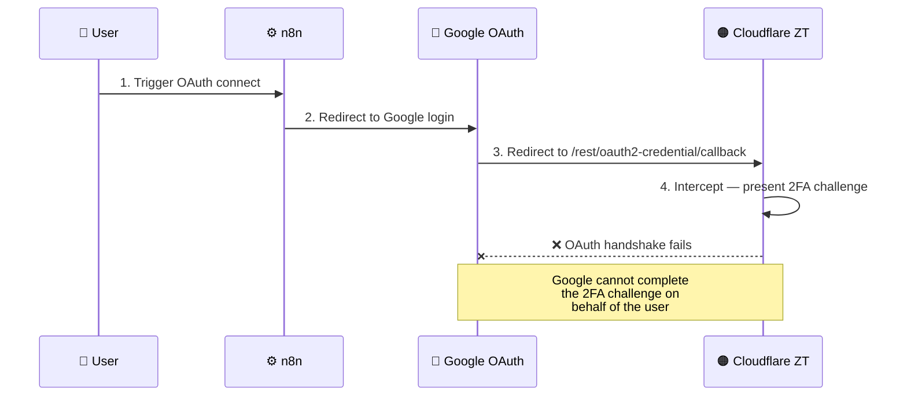

### The Solution: Zero Trust Child Application

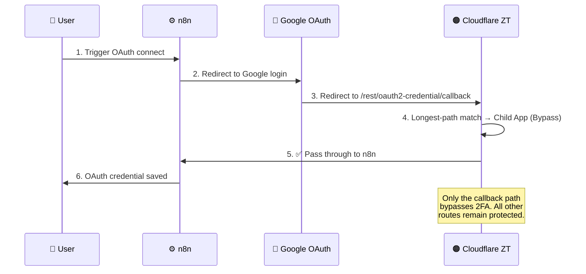

### Zero Trust Access Policy Hierarchy

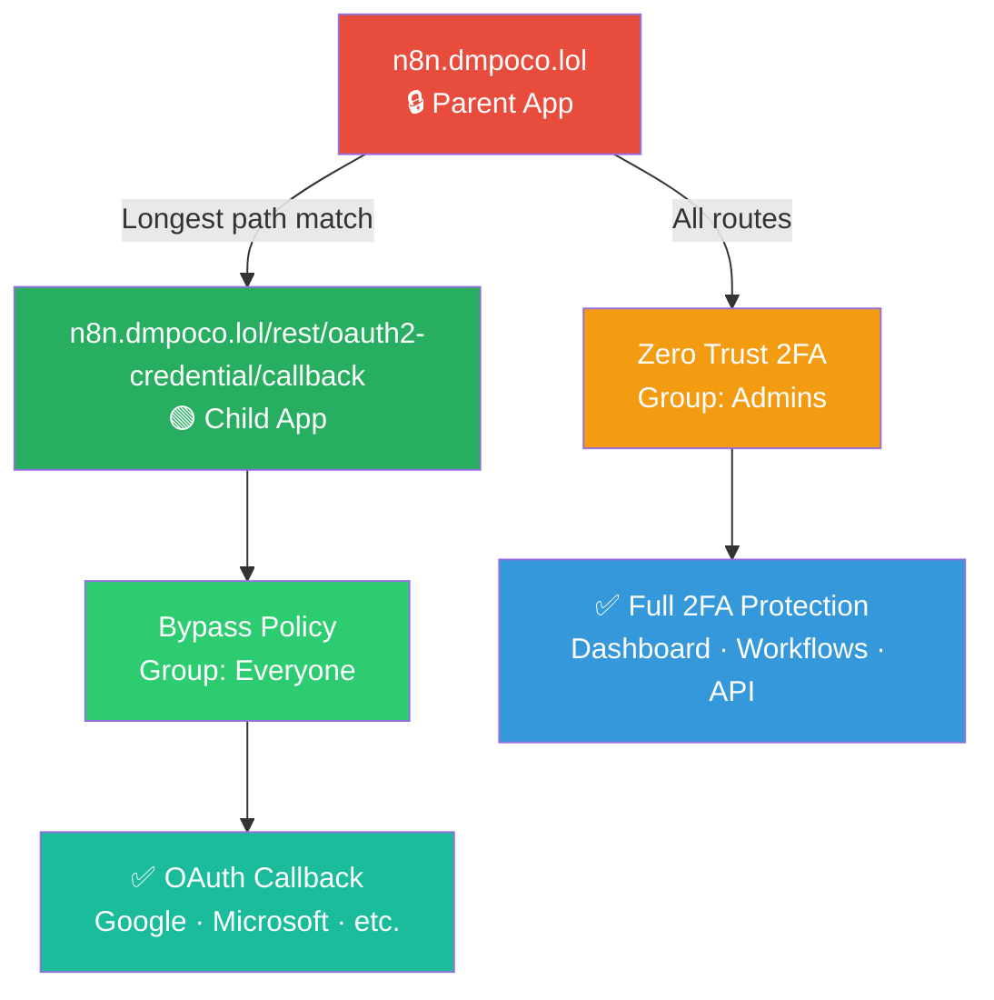

> **Security Insight:** Cloudflare prioritizes the most specific path. Only the OAuth callback bypasses 2FA; all other requests remain fully protected.

---

## ⚠️ Phase 3: Fixing SSL "Death Loops" (HTTP 525/520)

Initial deployment caused SSL errors due to ALPN negotiation failure with Cloudflare's Orange Cloud proxy.

### SSL Resolution Sequence

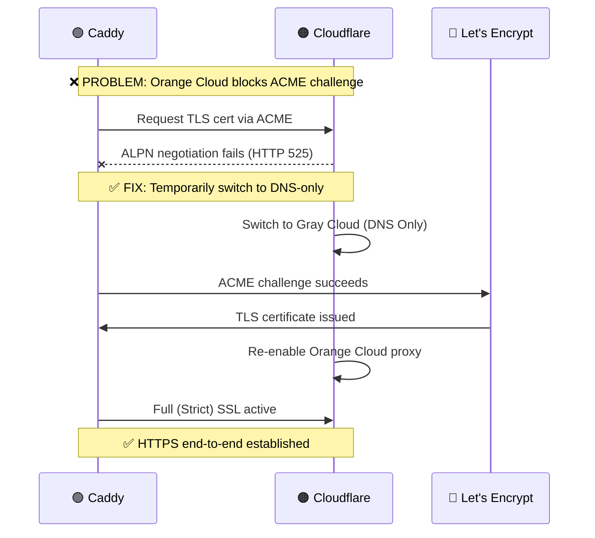

### Resolution Steps

1. Temporarily switched DNS to **Gray Cloud** (DNS Only) to allow Caddy to obtain a certificate
2. Re-enabled proxy with **Full (Strict) SSL**
3. End-to-end encryption established without further 525/520 errors

---

## 📂 Phase 4: Docker Permission Hardening

n8n initially failed to save internal encryption keys:

```
EACCES: permission denied
```

| Root Cause | Resolution |
|---|---|
| Docker volume owned by `root` | Recursive permission reassignment to UID 1000 |
| n8n runs as non-root `node` user | Match volume ownership to container user |

```bash
sudo chown -R 1000:1000 ./n8n_data
```

### Docker Container Security Model

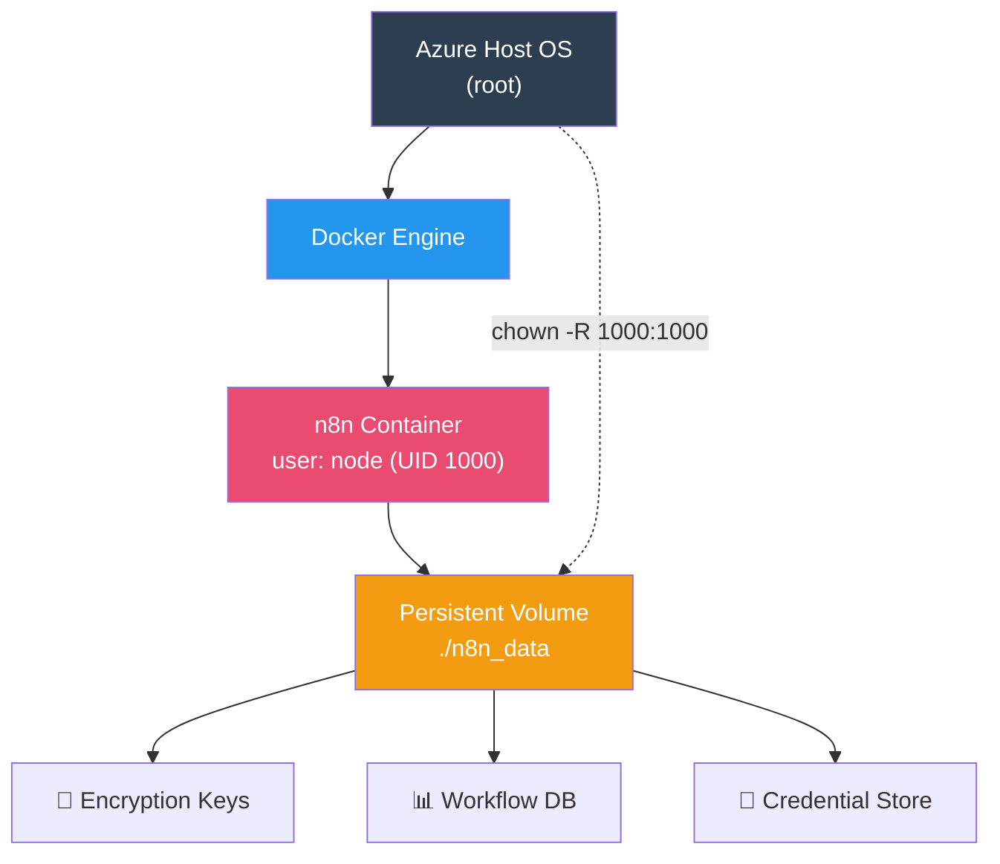

---

## 📊 Deployment Performance Metrics

| Metric | Original (Failed) | Optimized (Current) |
|---|---|---|
| Instance | Azure B1ls (1 GB RAM) | Azure B2als_v2 (4 GB RAM) |
| Swap Space | 0 GB | 2 GB Active |
| Node V8 Heap | Default (Unstable) | 2048 MB |
| SSL Setup | HTTP 525 Error | Full (Strict) via Caddy |
| Auth | Blocked by 2FA | Seamless Path Bypass |

### Before vs. After

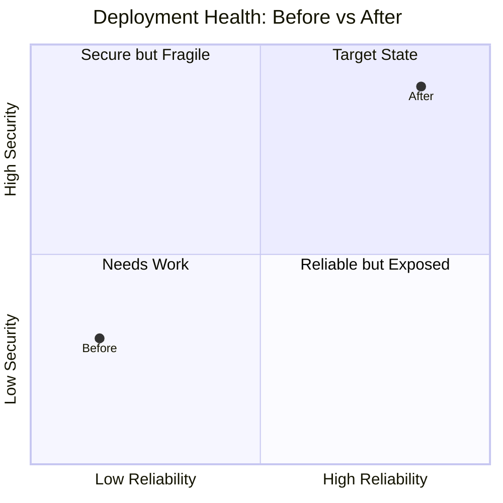

---

## 📁 Project Structure

```
the-warsaw-pipeline/
├── README.md              # This document — architecture & case study
├── docker-compose.yml     # n8n + Caddy service definitions
├── Caddyfile              # Reverse proxy & TLS configuration
└── n8n_data/              # Persistent volume (UID 1000)
    ├── .n8n/              # Encryption keys & credentials
    └── database.sqlite    # Workflow definitions
```

### Docker Compose Layout

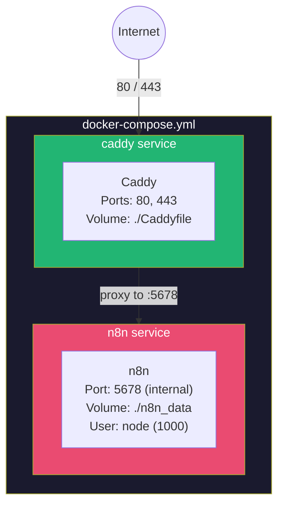

---

## 💡 Key Takeaways

| Lesson | Detail |
|---|---|
| **Zero Trust Nuance** | You can secure an entire domain while selectively bypassing critical OAuth endpoints using child applications and longest-path matching |
| **Hardware Resilience** | Node.js requires 4 GB+ RAM for production automation workflows; swap + V8 heap tuning provides the safety net |
| **Log-Driven Troubleshooting** | Errors like 520/525 only make sense after reviewing reverse proxy logs alongside Cloudflare diagnostics |
| **Security-First Docker** | Running containers as non-root with matched volume ownership is non-negotiable for production |

---

## 🧰 Tech Stack


---

<details>
<summary><strong>📌 Full Phase Progression Overview (click to expand)</strong></summary>

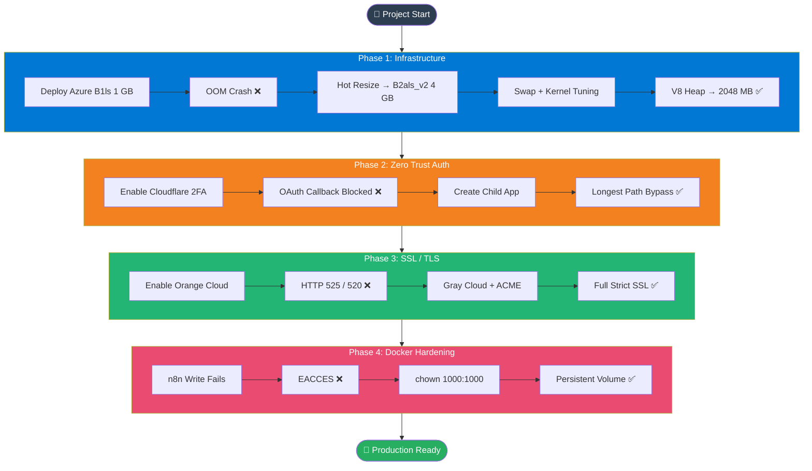

</details>